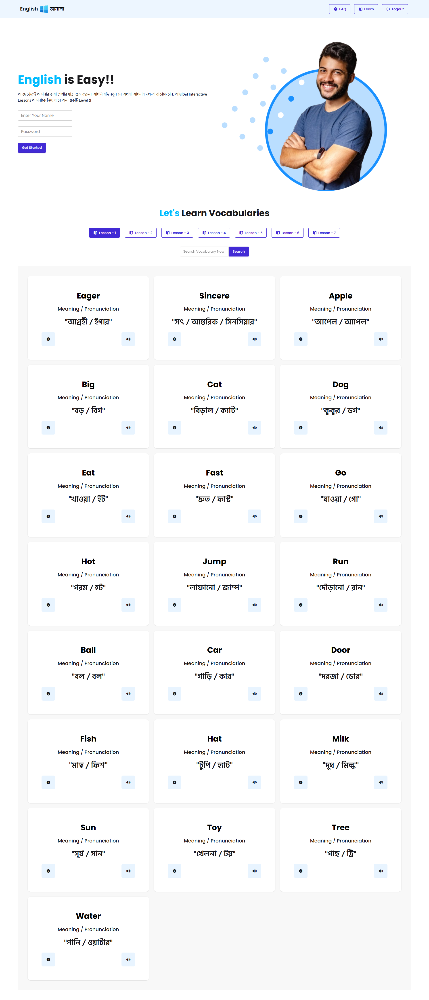

# English Janala

A simple English vocabulary learning website that I built while practicing **JavaScript, API integration, and DOM manipulation**.

The website helps users explore vocabulary lessons, search for words, view word details, and listen to word pronunciations.

## Features

* Lesson-based vocabulary learning
* Vocabulary search
* Word meaning and pronunciation
* Detailed word information in a modal
* Example sentences and synonyms
* Text-to-speech pronunciation
* Loading spinner while fetching data
* Handles unavailable vocabulary data

## Technologies Used

* HTML5
* JavaScript (ES6+)
* Tailwind CSS
* DaisyUI
* Font Awesome
* Programming Hero Open API
* Web Speech API

## What I Practiced

* Fetching data from REST APIs
* Working with `fetch()`
* Promises and `async/await`
* DOM manipulation
* Array methods like `map()`, `forEach()`, and `filter()`
* Dynamic HTML rendering
* Search functionality
* Modal handling
* Browser Speech Synthesis API

## Live Website

[View Live Website](https://english-janala-page.netlify.app)

## Screenshot

### GitHub: [FahmidaAkterShimu](https://github.com/FahmidaAkterShimu)
